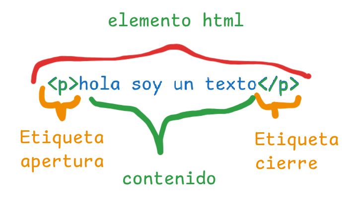
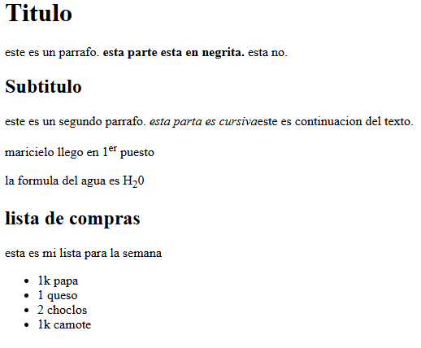

# Que es html
Segun sus siglas es Lenguaje de marcao de texto (Hiertext Markup Language)
Html es un enguaje que nos permite organizar uestro contenio de manera estructural. Nos permite crear contenio semantico al contenio que vayamos creano, eso significa que html inicara al navegaor que tipo de contenio eseamos mostrar.

## Que es un elemento HTML
Es la manera como html le da un sentio semantico al contenio.
### Estructura e un elemento

- <> - etiqueta e apertura
- .>< - contenido
- </ > - etiqueta e cierre
### Etiquetas en bloque
Cada vez que se crea una etiqueta se crea un bloque ↓
- h1 - titulos
- h2 - subtitulos
- p - parrafos
- ul - para crear listas desorenaas ocon viñetas, esta etiqueta usa en su contenio el elemento `li` para crear elemento e la lista.
- ol - para crear listas orenadas o con numeros, al igual que la etiqueta anterios debemos usar en sus contenido el elemento `li` para mostrar caa elemento de la lista
### Etiquetas en linea
entro el parrafo se hace un strong,  sea no saltara e parrafo, solo subraya una frase →
- strong - para poner en negrita
- i - letra cursiva
- sup - para poner un texto en super indice
- sub - para poner el tecto en sub indice
### Elemeto vacio
- hr - crea una linea de extremo a estremo

### Etiquetas con contenio
Son los elementos que tienen apertura, contenio y cierre. ejm: `<ht>titulo<h1>`
### Etiquetas vacias
Son elementos de que solo tienen la etiwueta de apertura ejm: `
`  o etiquetas e multimeia como ``.
### Atributos en etiquetas
Los atributos nos permiten ampliar la funcionalia de un elemento,los atributos se especifcan en las etiquetas de apertura, su estructura es la siguiente: `nombre="valor"` (como eclarar una variable).

*`` : src: sirve para escribir la ruta de la imagen y alt: sirve para describirle al cieguito lo que hay en la imagen*
### atributos e meia
- width : sirve para arlemedia a la imagen
``

existen atributos creados y personalizada