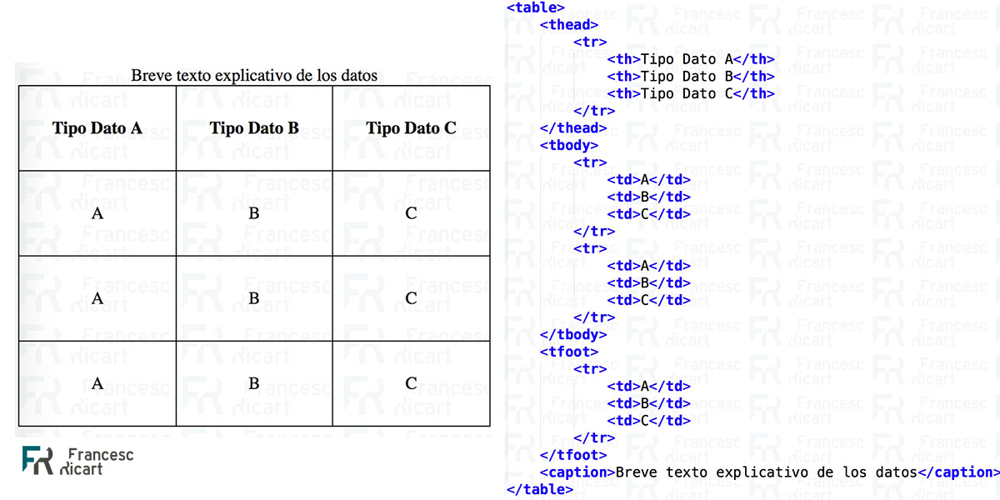

# HTML intermedio
## Elementos de link
Estos elemetos son aquellas etiquetas que hacen referencias a recursos externos que utilizara mi web.
dentro de estos tenemos a:
- `script:` etiqueta que permite asociar un archivo JS a mi pagina.
- `link:` etiqueta que permite asociar una archivo CSS en mi pagina.
- `a:` etiqueta conocida como anclaje que me permite referenciar otras paginas.

```html
<script> 
    //aqui puedo ejecutar o escribir codigo javascript
</script>

<script>
//en lugar de escribir codigo podemos asociar un archivo javascript
</script>

<script src="./js/script.js"></script>
```
**link**
es una etiqueta que no tiene contenio, o sea que no tiene etiqueta de cierre, es un `elemento bacio`
```html
<link href="./css/style.css">
```
**a**
```html
<a href="https://www.facebook.com">hasme un clic</a>
```
## Elementos de estructura (html semantico)
los elementos de estructura permiten organizar de manera visual nuestras etiquetas html (organizar y agrupar), son elementos padre que pueden tener elementos hijo.
- `html:` para encerrar todo el contenido html. es el elemento pare, tiene sus hijos principales:
- **head:** el elemento padre de los elementos de configuracion de la pagina.
- **body:** es elemento padre de todos los elementos visibles de mi pagina web.
- `nav:` elemento que nos permite agrupar elementos de **navegacion** como la etiqueta **a**.
- `header:` elemento que nos sirve para especificar la **cabecera** de un archivo html o de una seccion.
- `aside` elemento que nos sirve para **agrupar etiquetas** cuya informacion no es tan relevante al contenido (contenio **secundario**, promociones, publicidad).
- `seccion:` permite **agrupar etiquetas** que se asemejen o tengan la **misma informacion** en un solo elemento.
- `articule:` elemento que por lo general se usa **dentro del elemento section** y permite **agrupar informacion** de la seccion.
- `footer:` elemento para agrupar informacion de **pie de pagina**. se suele usar al final de nuestro contenio html o al final del elemento section.
- `div:` **elemento estructural** pero no es semantico por que no aporta ninguna informacion al navegador sobre el contenido descrito en un interior.

## elementos de formulario:
Son aquellos que nos permitira **interactuar con el usuario y con un backend** de ser necesario para el almacenamiento de informacion (`persistenccia de datos:` cuando la info esta almacenada en una base de datos y nos permite realizar la consulta, como el hdd).
- `form:` es el elemento principal o el elemento padre.
- `input:` elemento que me permitira interactuar con el usuario.
- `button:` para darle acciones al formulario (para ejecutar metodos) 
## Elementos de tabla (tarea):
Una tabla puede ser sencilla o compleja, dependiendo de nuestro objetivo y la cantidad de etiquetas o atributos a utilizar.
1. `table`: Etiqueta **contenedora** que tendrá en su interior toda la **tabla**.
2. `tr`: **Table Row**. Etiqueta contenedora de cada fila de la tabla.
3. `td`: **Table Data**. Cada una de las celdas de la tabla.
    - `tbody`: Define la sección del cuerpo de la tabla (o sea, la parte principal con las etiquetas **td**).
4. `th`: **Table Header**. Cada una de las celdas de cabecera de la tabla  (por defecto, se muestra en negrita y se centra). 
    - `thead`: Define la sección de cabecera de la tabla (o sea, la parte superior con las etiquetas **th**). 
- `tfoot`: Define la sección del pie de la tabla (o sea, la parte inferior con información adicional o resumen). 
- `caption`: Define una leyenda o título para la tabla. 
- `colgroup`: Permite definir grupos de columnas para aplicar estilos a varias columnas a la vez. 
- `col`: Define las propiedades de estilo para una columna individual dentro de un `colgroup`. 
```html
<table>
  <caption>Tabla de ejemplo</caption>
  <thead>
    <tr>
      <th>Nombre</th>
      <th>Apellido</th>
      <th>Edad</th>
    </tr>
  </thead>
  <tbody>
    <tr>
      <td>Juan</td>
      <td>Pérez</td>
      <td>30</td>
    </tr>
    <tr>
      <td>María</td>
      <td>Gómez</td>
      <td>25</td>
    </tr>
  </tbody>
  <tfoot>
    <tr>
      <td colspan="2">Total</td>
      <td>55</td>
    </tr>
  </tfoot>
</table>
```
