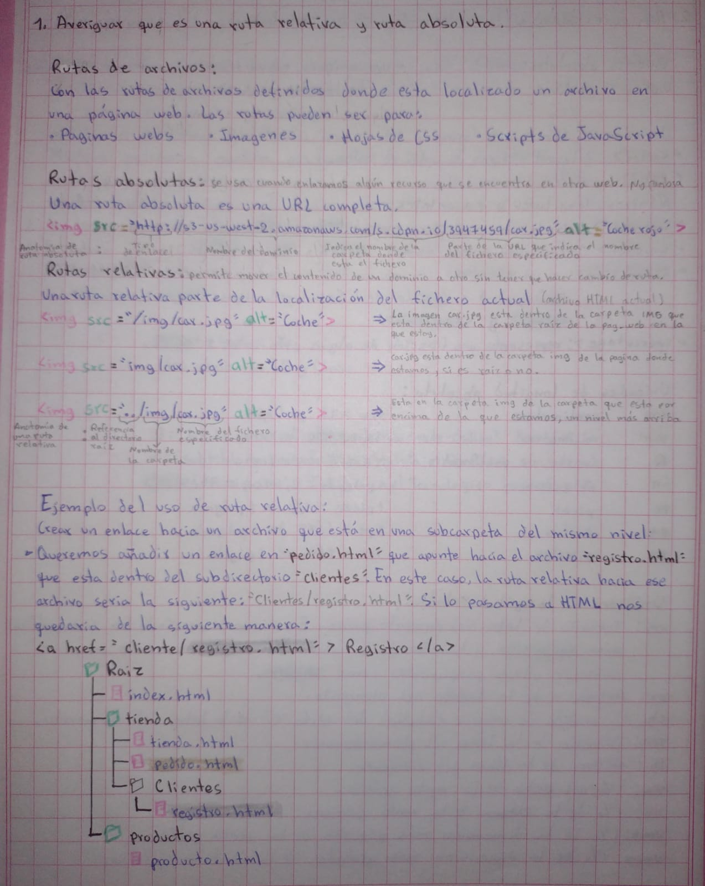
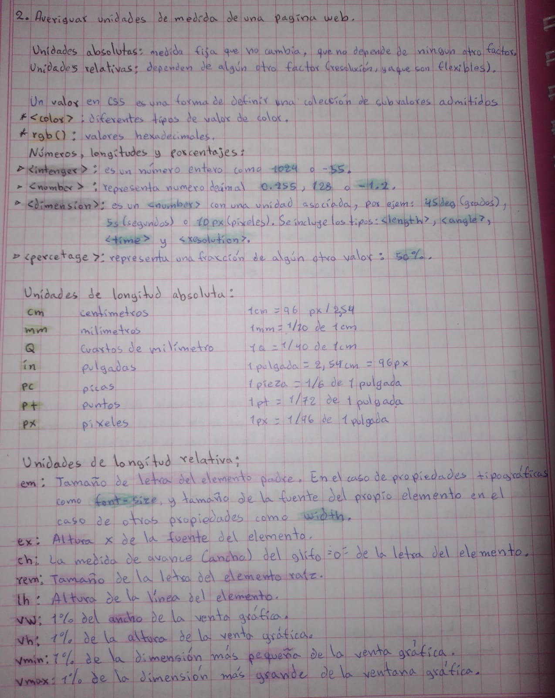
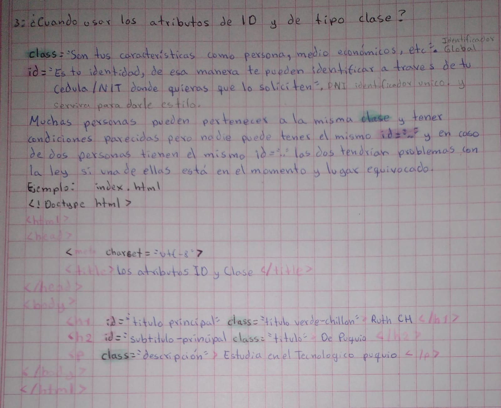
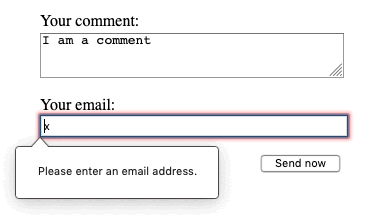
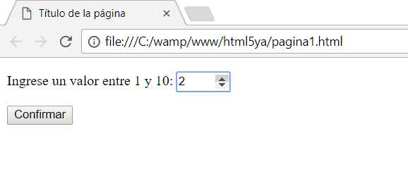
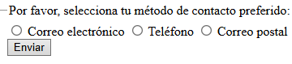
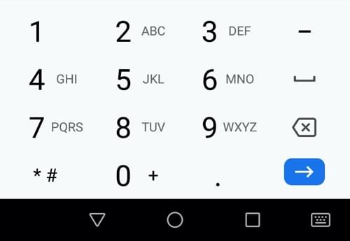
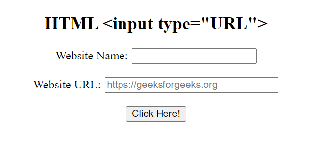

#Tarea:




##Tipos de INPUT

se utilizan para crear campos de entrada en formularios, **permitiendo a los usuarios ingresar datos** de diversos tipos, como texto, números, fechas, etc. La etiqueta input tiene un atributo type que determina el tipo de campo de entrada y su comportamiento. 

- `type="button"`: Botón sin un comportamiento específico. Representa un elemento cliqueable: **<button name="button">Click me</button>**. botones que solamente utilizan un ícono para representar una funcionalidad: **<button name="favorito" type="button">**
- `checkbox`: Casilla de selección. Usar el atributo **value** para definir el valor que se enviará por este elemento, **checked** para indicar si el elemento está seleccionado, **indeterminate** (olo se puede establecer programaticamente) indica que la casilla está en un estado indeterminado (en la mayoría de las plataformas, se dibuja una línea horizontal a través de la casilla).
- `color`: Control para espicificar un color. Una interfaz de selección de color no requiere más funcionalidad que la de aceptar colores simples como texto.

- `date`: Control para introducir una fecha (año, mes y día, sin tiempo).
- `time`: Control para introducir un valor de tiempo sin zona horaria específica.
- `datetime`: Obsoleto Control para introducir una fecha y hora (horas, minutos, segundos y fracción de segundo), basado en la zona horaria UTC.
- `datetime-local`: Control para introducir fecha y hora, sin zona horaria específica.
- `month`: Control para introducir un mes y año, sin zona horaria específica.
- `week`: Control para introducir una fecha que consiste en número de semana del año y número de semana sin zona horaria específica.

- `email:` al utilizar este atributo obligamos al usuario a que ingrese su email, en caso no ingrese su gmail le aparecera un mensaje de error.
- 
- `file`: Control que permite al usuario seleccionar un archivo. Se puede usar el atributo accept para definir los tipos de archivo que el control podrá seleccionar.
- `hidden`: Control que no es mostrado en pantalla, pero cuyo valor es enviado al servidor.
- `image`: Botón de envío de formulario con gráfico. Se debe usar el atributo **src** para definir el origen de la imagen y el atributo **alt** para definir un texto alternativo. Se puede usar los atributos **height y width** para definir el tamaño de la imagen en píxeles.
 
- `number`: similar a un campo de texto que solo permite números de punto flotante, y normalmente proporciona botones deslizadores para incrementar o reducir el valor del control. (puedes limitar los valores mínimo y máximo permitidos definiendo los atributos **min y max**.)

- `password:`  proporcionan una forma para que el usuario ingrese una contraseña de forma segura.
- `radio`: Solo un botón de radio en un grupo dado puede estar seleccionado al mismo tiempo. Los botones de radio generalmente se representan como pequeños círculos, que se rellenan o resaltan cuando están seleccionados.
```html
<form>
  <fieldset>
    <legend>Por favor, selecciona tu método de contacto preferido:</legend>
    <div>
      <input type="radio" id="contactChoice1" name="contact" value="email" />
      <label for="contactChoice1">Correo electrónico</label>

      <input type="radio" id="contactChoice2" name="contact" value="phone" />
      <label for="contactChoice2">Teléfono</label>

      <input type="radio" id="contactChoice3" name="contact" value="mail" />
      <label for="contactChoice3">Correo postal</label>
    </div>
    <div>
      <button type="submit">Enviar</button>
    </div>
  </fieldset>
</form>
```


- `range`: Control para introducir un número cuyo valor exacto no es importante. Este control usa los siguientes valores predeterminados si no se especifica cada atributo:
  - min: 0
  - max: 100
  - value: min + (max - min) / 2, o *min* si *max* es menor que *min*
  - step: 1
- `reset`: Botón que restaura los contenidos de un formulario a sus valores predeterminados.
- `search`: se utiliza como cajas de busqueda (como el buscador de google) en paginas y aplicaciones.A menudo los campos search se muestran con bordes redondeados; y a veces también muestran una "Ⓧ".
- `submit`: Botón que envía el formulario.
- `tel:` se crea un campo de un teclado numerico.

- `text`: Campo de texto de línea simple. Los saltos de línea son eliminados automáticamente del valor introducido.

- `url`: se crea un tipo especial de campo para introducir URLs. En caso no se valide se mostrara un error por no ingresar en protocolo **https:**


>[!TIP]
Puedes utilizar el **atributo multiple** en combinación con el tipo **input email** para permitir que sean introducidas varias direcciones de correo electrónico separadas por comas en el mismo input:
```html
<input type="email" id="email" name="email" multiple />
```