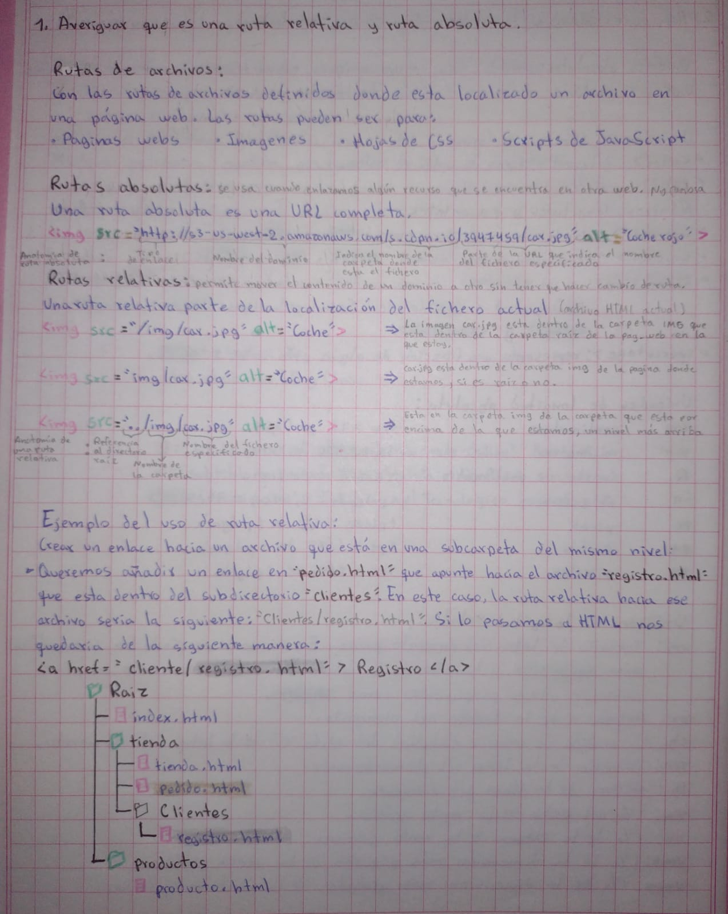
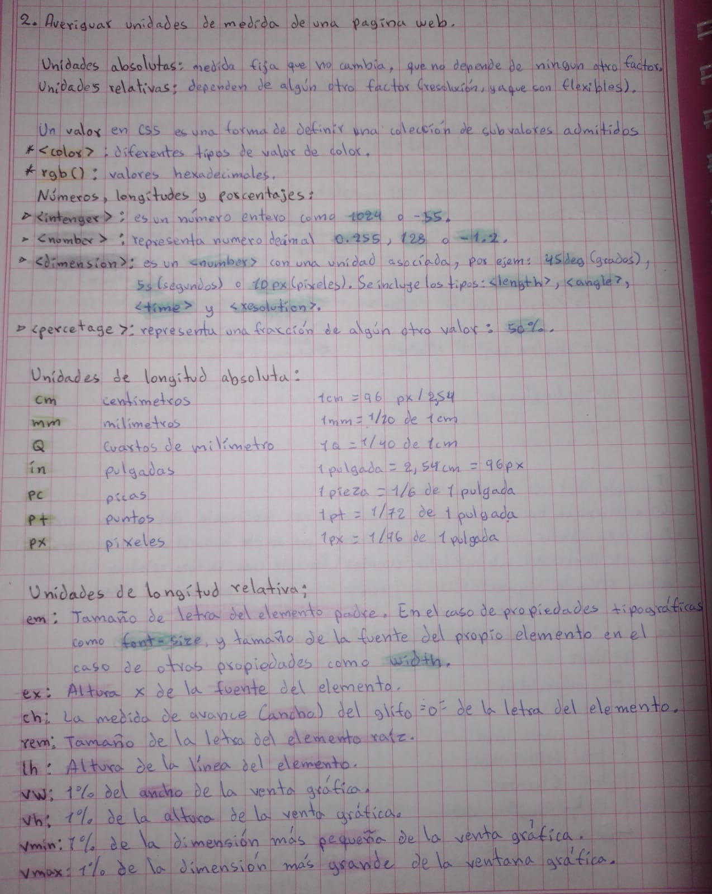
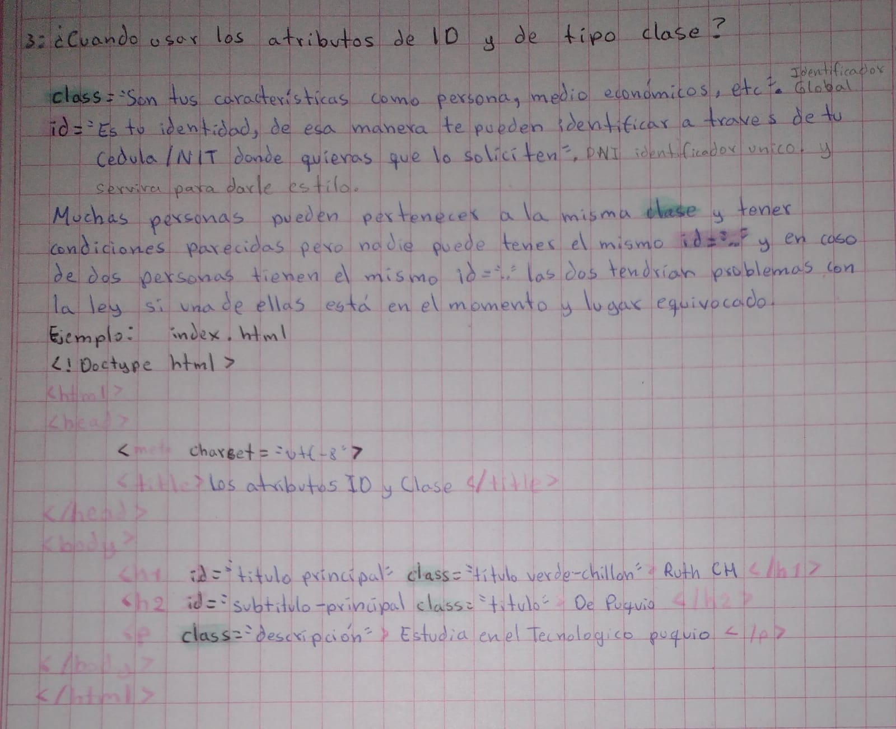
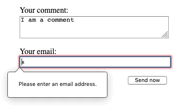
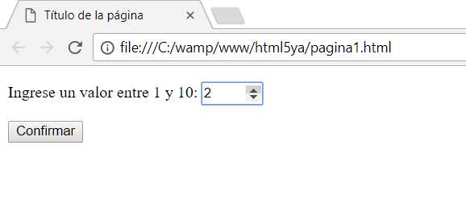
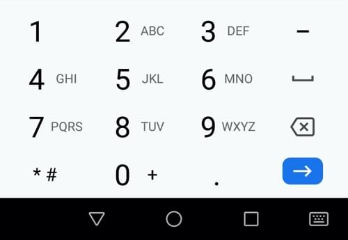
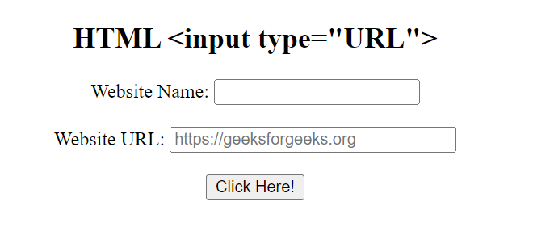
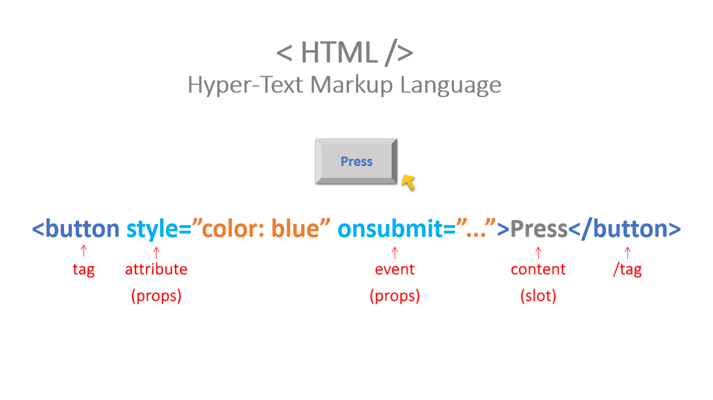
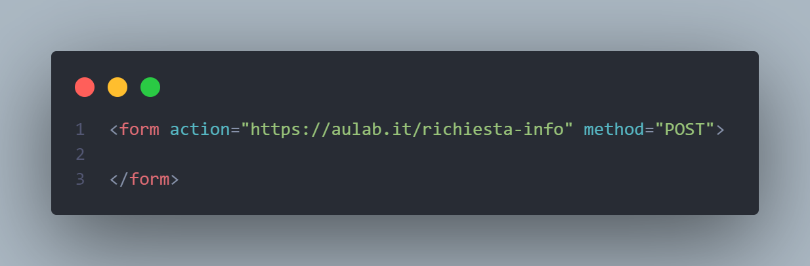

#Tarea:




## Tipos de INPUT

se utilizan para crear campos de entrada en formularios, **permitiendo a los usuarios ingresar datos** de diversos tipos, como texto, números, fechas, etc. La etiqueta input tiene un atributo type que determina el tipo de campo de entrada y su comportamiento. 

- `type="button"`: Botón sin un comportamiento específico. Representa un elemento cliqueable: **<button name="button">Click me</button>**. botones que solamente utilizan un ícono para representar una funcionalidad: **<button name="favorito" type="button">**
- `checkbox`: Casilla de selección. Usar el atributo **value** para definir el valor que se enviará por este elemento, **checked** para indicar si el elemento está seleccionado, **indeterminate** (olo se puede establecer programaticamente) indica que la casilla está en un estado indeterminado (en la mayoría de las plataformas, se dibuja una línea horizontal a través de la casilla).
- `color`: Control para espicificar un color. Una interfaz de selección de color no requiere más funcionalidad que la de aceptar colores simples como texto.

- `date`: Control para introducir una fecha (año, mes y día, sin tiempo).
- `time`: Control para introducir un valor de tiempo sin zona horaria específica.
- `datetime`: Obsoleto Control para introducir una fecha y hora (horas, minutos, segundos y fracción de segundo), basado en la zona horaria UTC.
- `datetime-local`: Control para introducir fecha y hora, sin zona horaria específica.
- `month`: Control para introducir un mes y año, sin zona horaria específica.
- `week`: Control para introducir una fecha que consiste en número de semana del año y número de semana sin zona horaria específica.

- `email:` al utilizar este atributo obligamos al usuario a que ingrese su email, en caso no ingrese su gmail le aparecera un mensaje de error.
- 
- `file`: Control que permite al usuario seleccionar un archivo. Se puede usar el atributo accept para definir los tipos de archivo que el control podrá seleccionar.
- `hidden`: Control que no es mostrado en pantalla, pero cuyo valor es enviado al servidor.
- `image`: Botón de envío de formulario con gráfico. Se debe usar el atributo **src** para definir el origen de la imagen y el atributo **alt** para definir un texto alternativo. Se puede usar los atributos **height y width** para definir el tamaño de la imagen en píxeles.
 
- `number`: similar a un campo de texto que solo permite números de punto flotante, y normalmente proporciona botones deslizadores para incrementar o reducir el valor del control. (puedes limitar los valores mínimo y máximo permitidos definiendo los atributos **min y max**.)

- `password:`  proporcionan una forma para que el usuario ingrese una contraseña de forma segura.
- `radio`: Solo un botón de radio en un grupo dado puede estar seleccionado al mismo tiempo. Los botones de radio generalmente se representan como pequeños círculos, que se rellenan o resaltan cuando están seleccionados.
```html
<form>
  <fieldset>
    <legend>Por favor, selecciona tu método de contacto preferido:</legend>
    <div>
      <input type="radio" id="contactChoice1" name="contact" value="email" />
      <label for="contactChoice1">Correo electrónico</label>

      <input type="radio" id="contactChoice2" name="contact" value="phone" />
      <label for="contactChoice2">Teléfono</label>

      <input type="radio" id="contactChoice3" name="contact" value="mail" />
      <label for="contactChoice3">Correo postal</label>
    </div>
    <div>
      <button type="submit">Enviar</button>
    </div>
  </fieldset>
</form>
```


- `range`: Control para introducir un número cuyo valor exacto no es importante. Este control usa los siguientes valores predeterminados si no se especifica cada atributo:
  - min: 0
  - max: 100
  - value: min + (max - min) / 2, o *min* si *max* es menor que *min*
  - step: 1
- `reset`: Botón que restaura los contenidos de un formulario a sus valores predeterminados.
- `search`: se utiliza como cajas de busqueda (como el buscador de google) en paginas y aplicaciones.A menudo los campos search se muestran con bordes redondeados; y a veces también muestran una "Ⓧ".
- `submit`: Botón que envía el formulario.
- `tel:` se crea un campo de un teclado numerico.

- `text`: Campo de texto de línea simple. Los saltos de línea son eliminados automáticamente del valor introducido.

- `url`: se crea un tipo especial de campo para introducir URLs. En caso no se valide se mostrara un error por no ingresar en protocolo **https:**


>[!TIP]
Puedes utilizar el **atributo multiple** en combinación con el tipo **input email** para permitir que sean introducidas varias direcciones de correo electrónico separadas por comas en el mismo input:
```html
<input type="email" id="email" name="email" multiple />
```
## Atributos del button 06/05/25

```html
<button name="button">Click me</button>
```
**Genéricos**
1. `title`:	Texto informativo o título del elemento. Suele mostrarse a modo de "tool tip".
2. `id`:	Le da un nombre al elemento que lo diferencia de todos los demás del documento.
3. `class`:	Asigna nombres de clases al elemento. Por defecto, clases CSS.
4. `style`:	Permite especificar información de estilo. Por defecto, estilos CSS.
5. `lang`:	Información sobre el idioma del contenido del elemento y del valor de sus atributos.
6. `dir`:	Indica la dirección de texto y tablas (Uno de los siguientes: 'ltr' o 'rtl'.).
**Específicos**
7. `name`:	Asigna un nombre de control.
8. `value`:	Asigna un valor inicial que será enviado con el formulario.
9. `type`:	Indica el tipo de botón.
10. `disabled`:	Indica que el control está desabilitado.
11. `accesskey`:	Define una tecla de acceso rápido. Importante para la Accesibilidad.
12. `tabindex`:	Asigna un número de posición en el orden de tabulación.
13. `reserved`:	Reservado para un uso futuro que nunca tubo. Inútil
____________________________________________________________
```HTML
<input type="button" value="Click me" />
```
1. `disabled`: Este atributo booleano indica que el usuario no puede interactuar con el botón.
2. `autofocus`: permite especificar que el botón deba tener el foco cuando la página se cargue, a no ser que el usuario lo anule.
3. `autocomplete`: El uso de este atributo eS específico de Firefox que por defecto y al contrario de otros navegadores, mantiene el estado de desactivación dinámico de un **button** a lo largo de las cargas de la página. Establecer el valor de este atributo a off (autocomplete="off") desactiva esta característica.
4. `form`: El elemento del formulario con el que el botón está asociado (es dueño del formulario).
5. `formenctype`: Debido a que el elemento de input es un botón de envío, el atributo formenctype especifica el tipo de contenido que se usa para enviar el formulario al servidor. Los valores posibles son:
 - **application/x-www-form-urlencoded:** Valor por defecto si el atributo no se especifica.
 - **multipart/form-data:** Este valor se usa si un elemento **input** es usado con el atributo type fijado a file.
 - **text/plain:** Si este atributo se especifica, ignora el atributo enctype del formulario dueño del botón.
6. `formaction`: La URI de la aplicación que procesa la información enviada por le botón. Si se especifica se anula el atributo action del formulario dueño del botón.
7. `formmethod`: especifica el método HTTP que el navegador utilizará para enviar el formulario. Los valores posibles son:
 - post
 - get
8. `formnovalidate`: especifica que el formulario no debe ser validado cuando sea enviado. 
9. `formtarget`: es un nombre o palabra clave que indica donde mostrar la respuesta recibida después de enviar el formulario. Las siguientes palabras claves tienen significados especiales:
 - **_self:** Carga la respuesta en el mismo contexto navegable que el actual. valor es el predeterminado.
 - **_blank:** Carga la respuesta en un nuevo contexto navegable sin nombre.
 - **_parent:** Carga la respuesta en el contexto navegable padre del actual. valor es el predeterminado.
 - **_top:** Carga la respuesta en el contexto navegable superior (es el contexto navegable que es un ancestro del actual y no tiene padre). valor es el predeterminado.
10. `name`:El nombre del botón que será enviado con los datos del formulario.
11. `type`: El tipo dle botón. Los valores posibles son:
 - **submit:** El botón envía los datos del formulario al servidor. Este es el valor predeterminado.
 - **reset:** El botón reinicia todos los controles a sus valores iniciales.
 - **button:** El botón no tiene comportamiento predeterminado.
12. `value`: El valor inicial del botón.
## Atributos booleanos 06/05/25
Significa que pueden ser true o false . Se cumplen o no se cumplen.
- `checked`: Indica si un elemento de radio o casilla de verificación está seleccionado. 
- `disabled:` Indica si un elemento (como un botón, campo de entrada, etc.) está inhabilitado para que el usuario no pueda interactuar con él. 
- `required:` Indica que un campo de formulario es obligatorio y el usuario debe completarlo antes de enviar. 
- `open:` Indica si un elemento **details** debe estar visible y abierto. 
- `autofocus:` Indica que un elemento debe recibir el enfoque del usuario al cargar la página. 
- `inert:` Indica que un elemento no debe recibir eventos del usuario. 
- `readonly:` Indica que un elemento de entrada no puede ser editado por el usuario. 
- `multiple:` Indica que un elemento de selección (como un **select**) permite seleccionar múltiples opciones. 
- `selected:` Indica que una opción en un menú desplegable **select** está seleccionada. 

```html
<input type="checkbox" checked> <!---La casilla de verificación estará marcada por defecto.-->
<input type="text" disabled> <!---El campo de texto estará deshabilitado y no se podrá editar.-->
<input type="email" required>
```
## Propiedad ACTION 06/05/25

Permite cargar archivos multimedia en mi formulario.
El atributo action dentro de la etiqueta **form** especifica la URL a la que se enviarán los datos del formulario cuando se envía. Esta URL suele apuntar a un archivo (script) en el servidor que procesa los datos, aunque también puede apuntar a una página web o incluso a un script de JavaScript en el cliente. 